<!--
  Animated terminal portrait generated from the current GitHub profile photo.
  Regenerate with:
  python scripts/prep_photo.py source-photo.png
  python scripts/make_ascii_svg.py
  python scripts/make_info_card.py
-->
<table>
<tr>
<td valign="top"></td>
<td valign="top"></td>
</tr>
</table>

## Utsav Somaiya

**Product & Technology Consultant · Laravel Builder · Practical AI**

 

<!-- Refreshed daily by .github/workflows/update-profile-art.yml -->

